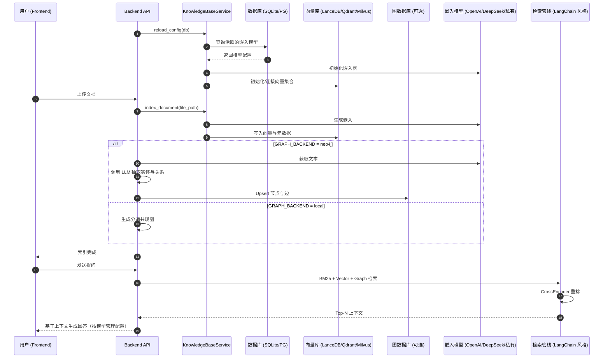

# Taichi Agent - 智能体编排与知识管理平台

Taichi Agent 是一个现代化的智能体（Agent）管理与编排平台，旨在帮助开发者和企业轻松构建、管理和部署基于 LLM 的 AI 智能体。

本项目采用了前后端分离架构，集成了 **Agno (原 Phidata)** 智能体框架、**DeepSeek/OpenAI** 模型，并提供可插拔的 **LangChain 风格混合检索管线**（BM25 + 向量 + 图谱 + 重排）；可选接入 **Neo4j** 图数据库与 **N8N** 工作流工具，提供一站式的智能体解决方案。

---

## ✨ 核心特性

*   **🤖 智能体管理 (Agent Management)**
    *   可视化创建、编辑和管理 AI 智能体。
    *   支持多种角色（Persona）配置和系统提示词（System Prompt）定制。
    *   基于 **Agno** 框架，具备强大的工具调用（Function Calling）能力。

*   **🧠 增强型知识库 (Knowledge Base)**
    *   **混合检索管线**：BM25 关键词检索 + 向量相似度检索 + 图谱检索，支持 **CrossEncoder** 重排
    *   **向量后端可插**：默认 LanceDB；可切换 **Qdrant** 或 **Milvus**（私有化部署）
    *   **图谱后端可插**：默认本地分词共现图；可切换 **Neo4j**，并通过大模型进行实体与关系抽取入库
    *   **模型管理集成**：嵌入与生成模型从数据库动态加载，支持 DeepSeek / OpenAI / 私有兼容接口
    *   **可视化**：知识图谱前端展示，并在不可用时返回明确原因（不伪造数据）

*   **🔄 工作流编排 (Workflow Automation)**
    *   集成 **N8N** 自动化平台，允许智能体触发复杂的工作流。
    *   通过 Webhook 实现 Agent 与 N8N 的无缝连接，扩展 Agent 的执行边界（如发送邮件、操作 CRM、数据抓取等）。

*   **💬 智能问答 (Smart QA)**
    *   提供类似 ChatGPT 的对话界面。
    *   支持多模态交互（文本/图片/文件）。
    *   实时流式响应（Streaming Response）。

---

## 🏗️ 知识库服务流程 (Sequence Diagram)

系统采用动态配置的知识库服务，支持从数据库加载嵌入模型配置，并提供可插拔的混合检索与图谱生成能力。



---

## 🛠️ 技术栈

### 前端 (Frontend)
*   **框架**: Vue 3 + Vite
*   **UI 组件库**: Ant Design Vue 4.0
*   **样式**: Tailwind CSS 3.3
*   **可视化**: v-network-graph (知识图谱展示)
*   **状态管理**: Pinia

### 后端 (Backend)
*   **框架**: FastAPI (Python 3.10+)
*   **Agent 框架**: Agno (Phidata)
*   **编排**: LangChain 风格检索管线
*   **向量库**: LanceDB（默认）、Qdrant（可选）、Milvus（可选）
*   **图数据库**: Neo4j（可选，默认本地分词共现）
*   **重排**: sentence-transformers CrossEncoder / 可扩展 ColBERT
*   **数据库**: PostgreSQL/SQLite（业务数据）
*   **缓存/队列**: Redis
*   **ORM**: SQLAlchemy + AsyncPG

---

## 🚀 快速开始

### 1. 环境准备
确保您的开发环境已安装以下工具：
*   **Python 3.10+**
*   **Node.js 18+**
*   **Docker** (用于运行 Graphiti, N8N, Redis 等服务)
*   **PostgreSQL** (或使用 SQLite 开发)

### 2. 后端配置与启动

进入后端目录并创建虚拟环境：
```bash
cd backend
python3 -m venv venv
source venv/bin/activate  # macOS/Linux
# venv\Scripts\activate   # Windows
```

安装依赖：
```bash
pip install -r requirements.txt
```

配置环境变量：
在 `backend` 目录下创建 `.env` 文件，参考以下配置：

```ini
# --- 基础配置 ---
PROJECT_NAME="Taichi Agent"
USE_SQLITE=True
# POSTGRES_SERVER=localhost

# --- 模型服务 (DeepSeek / OpenAI) ---
OPENAI_API_KEY=sk-xxxx
DEEPSEEK_API_KEY=sk-xxxx
DEEPSEEK_BASE_URL=https://api.deepseek.com

# --- 检索后端选择 ---
VECTOR_BACKEND=lancedb    # lancedb | qdrant | milvus
GRAPH_BACKEND=local       # local | neo4j
RERANK_ENABLED=True
RERANK_MODEL=cross-encoder/ms-marco-MiniLM-L-6-v2

# --- Qdrant ---
QDRANT_URL=http://localhost:6333
# QDRANT_API_KEY=xxxx
QDRANT_COLLECTION=kb_chunks

# --- Milvus ---
MILVUS_HOST=127.0.0.1
MILVUS_PORT=19530
MILVUS_COLLECTION=kb_chunks

# --- Neo4j ---
NEO4J_URI=bolt://localhost:7687
NEO4J_USER=neo4j
NEO4J_PASSWORD=password
```

启动后端服务：
```bash
python -m uvicorn app.main:app --reload --host 0.0.0.0 --port 8000
```

### 3. 前端配置与启动

进入前端目录：
```bash
cd frontend
npm install
```

启动开发服务器：
```bash
npm run dev
```
访问浏览器：`http://localhost:5173`

### 4. 启动外部服务 (Neo4j & N8N， 可选)

为了完整体验知识图谱和工作流功能，建议使用 Docker 启动相关服务。

**启动 Neo4j (图数据库):**
```bash
docker run -d --name neo4j -p 7474:7474 -p 7687:7687 -e NEO4J_AUTH=neo4j/password neo4j:5
```
启用 `.env` 中 `GRAPH_BACKEND=neo4j` 后，系统会在索引后台任务中通过大模型抽取实体/关系并写入 Neo4j。

**启动 N8N (工作流):**
```bash
docker run -it --rm --name n8n -p 5678:5678 -v ~/.n8n:/home/node/.n8n n8nio/n8n
```

---

## 📖 使用指南

1.  **模型配置**: 进入「模型管理」，添加/激活嵌入与生成模型（DeepSeek / OpenAI）
2.  **后端选择**: 在 `.env` 配置向量与图谱后端（如 Qdrant/Milvus/Neo4j）
3.  **知识库上传**: 在「知识库」页面上传文档；系统按后端写入向量；若启用 Neo4j，将通过大模型抽取实体/关系并入库
4.  **图谱查看**: 在前端图谱弹窗查看；若不可用会显示明确原因
5.  **开始对话**: 在「智能问答」界面提问；系统使用混合检索 + 重排输出 Top-N 上下文并生成回答

---

## 🤝 贡献
欢迎提交 Issue 和 Pull Request 来改进本项目！

## 📄 许可证
MIT License
