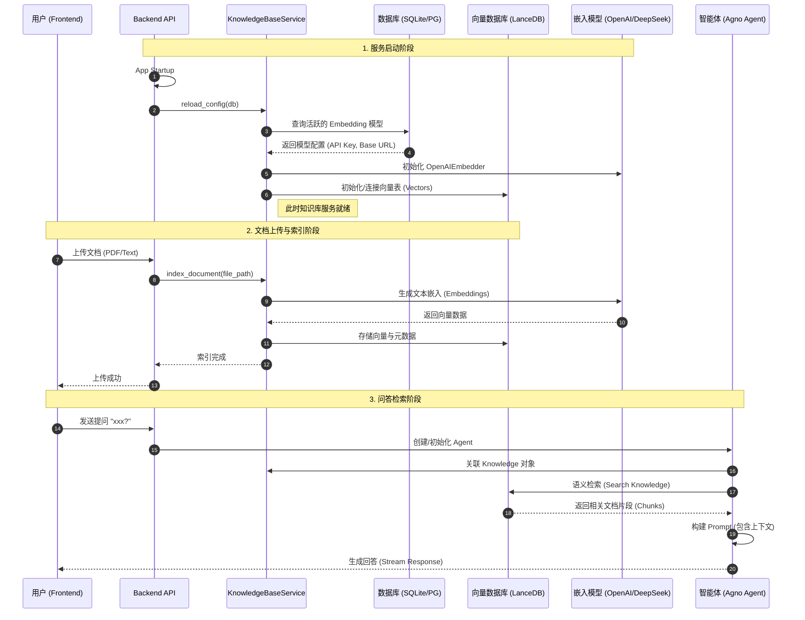

# Recorder AI - 智能体编排与知识管理平台

Recorder AI 是一个现代化的智能体（Agent）管理与编排平台，旨在帮助开发者和企业轻松构建、管理和部署基于 LLM 的 AI 智能体。

本项目采用了前后端分离架构，集成了 **Agno (原 Phidata)** 智能体框架、**DeepSeek** 深度推理模型、**Graphiti** 知识图谱引擎以及 **N8N** 工作流自动化工具，提供了一站式的智能体解决方案。

---

## ✨ 核心特性

*   **🤖 智能体管理 (Agent Management)**
    *   可视化创建、编辑和管理 AI 智能体。
    *   支持多种角色（Persona）配置和系统提示词（System Prompt）定制。
    *   基于 **Agno** 框架，具备强大的工具调用（Function Calling）能力。

*   **🧠 增强型知识库 (Knowledge Base)**
    *   **双引擎支持**：
        *   **向量检索**：基于 LanceDB 的本地向量数据库，支持 PDF/Word/Text 文档的语义检索。
        *   **知识图谱**：集成 **Graphiti** 引擎，自动从文档中提取实体关系，构建动态知识图谱。
    *   **DeepSeek 加持**：支持配置 DeepSeek 的 Embedding 模型 (`deepseek-embed`) 进行高效文本向量化。
    *   **可视化**：提供知识图谱的可视化界面，直观展示知识点之间的关联。

*   **🔄 工作流编排 (Workflow Automation)**
    *   集成 **N8N** 自动化平台，允许智能体触发复杂的工作流。
    *   通过 Webhook 实现 Agent 与 N8N 的无缝连接，扩展 Agent 的执行边界（如发送邮件、操作 CRM、数据抓取等）。

*   **💬 智能问答 (Smart QA)**
    *   提供类似 ChatGPT 的对话界面。
    *   支持多模态交互（文本/图片/文件）。
    *   实时流式响应（Streaming Response）。

---

## 🏗️ 知识库服务流程 (Sequence Diagram)

系统采用动态配置的知识库服务，支持从数据库加载嵌入模型配置，并在运行时提供高效的文档索引与检索能力。



---

## 🛠️ 技术栈

### 前端 (Frontend)
*   **框架**: Vue 3 + Vite
*   **UI 组件库**: Ant Design Vue 4.0
*   **样式**: Tailwind CSS 3.3
*   **可视化**: v-network-graph (知识图谱展示)
*   **状态管理**: Pinia

### 后端 (Backend)
*   **框架**: FastAPI (Python 3.10+)
*   **Agent 框架**: Agno (Phidata)
*   **数据库**: PostgreSQL (业务数据) + LanceDB (向量数据)
*   **缓存/队列**: Redis
*   **ORM**: SQLAlchemy + AsyncPG

---

## 🚀 快速开始

### 1. 环境准备
确保您的开发环境已安装以下工具：
*   **Python 3.10+**
*   **Node.js 18+**
*   **Docker** (用于运行 Graphiti, N8N, Redis 等服务)
*   **PostgreSQL** (或使用 SQLite 开发)

### 2. 后端配置与启动

进入后端目录并创建虚拟环境：
```bash
cd backend
python3 -m venv venv
source venv/bin/activate  # macOS/Linux
# venv\Scripts\activate   # Windows
```

安装依赖：
```bash
pip install -r requirements.txt
```

配置环境变量：
在 `backend` 目录下创建 `.env` 文件，参考以下配置：

```ini
# --- 基础配置 ---
PROJECT_NAME="Recorder AI"
USE_SQLITE=True  # 开发环境推荐开启
# POSTGRES_SERVER=localhost # 生产环境请配置 PG

# --- 模型服务 (DeepSeek / OpenAI) ---
OPENAI_API_KEY=sk-xxxx
DEEPSEEK_API_KEY=sk-xxxx
DEEPSEEK_BASE_URL=https://api.deepseek.com

# --- 外部服务集成 ---
# Graphiti 服务地址 (用于知识图谱)
GRAPHITI_URL=http://localhost:8000
```

启动后端服务：
```bash
python -m uvicorn app.main:app --reload --host 0.0.0.0 --port 8000
```

### 3. 前端配置与启动

进入前端目录：
```bash
cd frontend
npm install
```

启动开发服务器：
```bash
npm run dev
```
访问浏览器：`http://localhost:5173`

### 4. 启动外部服务 (Graphiti & N8N)

为了完整体验知识图谱和工作流功能，建议使用 Docker 启动相关服务。

**启动 Graphiti (知识图谱引擎):**
请参考 [Graphiti 官方文档](https://github.com/getzep/graphiti) 部署 Graphiti 服务，并确保其监听在 `8000` 端口（或修改 `.env` 中的配置）。

**启动 N8N (工作流):**
```bash
docker run -it --rm --name n8n -p 5678:5678 -v ~/.n8n:/home/node/.n8n n8nio/n8n
```

---

## 📖 使用指南

1.  **模型配置**: 进入「模型管理」，添加 DeepSeek 或 OpenAI 模型配置。
2.  **知识库上传**: 在「知识库」页面上传文档。系统会自动进行向量化索引，并尝试调用 Graphiti 生成知识图谱。
3.  **创建智能体**: 在「智能体管理」中创建一个新 Agent，关联已有的知识库。
4.  **开始对话**: 在「智能问答」界面选择刚才创建的 Agent，进行提问。

---

## 🤝 贡献
欢迎提交 Issue 和 Pull Request 来改进本项目！

## 📄 许可证
MIT License
