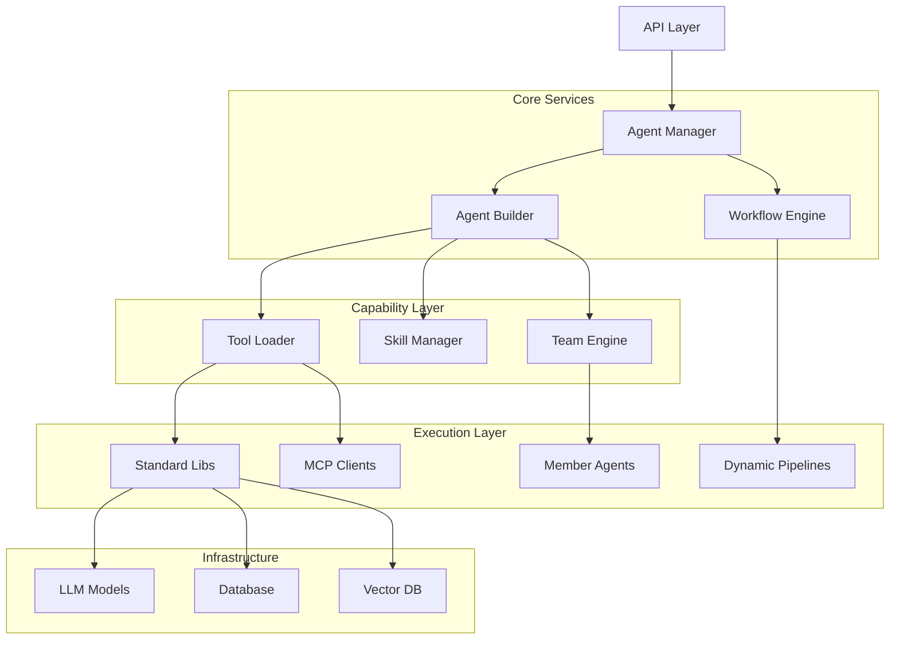

# Expert AI Hub (EAH) Agent Service

`eah_agent` 是 **Tiga** 后端的核心智能体服务模块，基于 [Agno](https://github.com/agno-agi/agno) 框架深度定制。它提供了一套企业级的、高度可扩展的架构，用于构建、编排和运行复杂的 AI 智能体（Agents）、多智能体团队（Teams）和自动化工作流（Workflows）。
旨在解决大模型应用中的“最后一公里”问题，将 LLM 的能力转化为可执行的业务逻辑。

---

## 🌟 核心特性 (Core Features)

- **🤖 动态智能体构建 (Dynamic Agent Builder)**
  - **配置驱动**: 完全基于数据库配置（JSON）动态实例化 Agent，无需硬编码。
  - **能力注入**: 自动根据配置注入工具（Tools）、技能（Skills）、知识库（RAG）和沙箱（Sandbox）能力。
  - **Prompt 编排**: 智能拼接系统提示词，确保 Agent 准确理解其能力边界。

- **🛠️ 全能工具系统 (Unified Tool System)**
  - **自动发现**: 自动扫描 `tools/libs` 和 `skills/` 目录，注册所有可用工具。
  - **本地化适配**: 所有内置工具均已适配中文元数据（名称、描述），便于前端展示。
  - **丰富生态**: 内置网络搜索、代码执行、数据库操作、云服务、办公自动化等 50+ 种工具。

- **🤝 多模式团队协作 (Multi-Mode Teams)**
  - **Coordinate (协调模式)**: Leader 智能分发任务并综合结果（适合复杂问题）。
  - **Route (路由模式)**: 精准路由至单一最佳专家（适合专业分流）。
  - **Broadcast (广播模式)**: 全员广播并汇总意见（适合投票/多视角分析）。
  - **Tasks (任务模式)**: 拆解为 To-Do List 逐项执行（适合长流程）。

- **⚡️ DAG 工作流引擎 (Workflow Orchestration)**
  - **动态编排**: 支持前端可视化的 DAG（有向无环图）配置，动态执行节点。
  - **状态管理**: 完整的 Session 和 Context 管理，支持断点续传和状态持久化。
  - **流式响应**: 标准化的 SSE 事件流，实时反馈每个步骤的执行状态。

---

## 🏗️ 架构概览 (Architecture)



---

## 📂 目录结构 (Directory Structure)

```text
eah_agent/
├── agent/              # [智能体] 构建核心
│   ├── builder.py      # AgentBuilder: 负责组装 Model, Tools, Prompt
│   └── prompt.py       # InstructionBuilder: 动态提示词生成器
├── core/               # [核心] 服务逻辑
│   ├── agent_manager.py # 统一入口 (Singleton)，管理 Agent/Team 生命周期
│   └── service.py      # 业务逻辑层 (CRUD)
├── skills/             # [技能] 扩展系统
│   ├── toolkit.py      # SkillToolkit: 将本地技能包转为 Agno 工具
│   └── manager.py      # 技能加载与执行管理
├── team/               # [团队] 协作引擎
│   ├── base_team.py    # 团队基类
│   ├── dynamic_team.py # DynamicTeam: 运行时团队构建引擎
│   └── *_team.py       # 预置团队 (Research, Operations)
├── tools/              # [工具] 注册中心
│   ├── libs/           # 本地化工具库 (Cloud, Data, Coding, etc.)
│   ├── loader.py       # 统一加载器 (Tools + Skills + MCP)
│   └── registry.py     # 自动发现与注册机制
└── workflow/           # [工作流] 编排引擎
    ├── base.py         # EAHWorkflow 基类 (状态管理)
    ├── pipelines/      # 流水线实现 (Dynamic, ResearchReport)
    └── schemas/        # 状态模型 (Pydantic Models)
```

---

## 📖 配置指南 (Configuration Guide)

### 1. 智能体工具配置 (`tools_config`)
在数据库的 `AgentModel` 中，`tools_config` 字段支持以下格式：

```json
[
  "duckduckgo",  // 简写：加载默认配置的工具
  {
    "name": "google_search", // 详细配置
    "config": {
      "api_key": "sk-...",
      "cse_id": "..."
    }
  },
  {
    "type": "skill", // 市场技能引用
    "name": "data-analysis",
    "content": "..." 
  }
]
```

### 2. 动态团队配置 (Dynamic Team Config)
调用 `agent_manager.create_team(db, "dynamic", config)` 时使用：

```json
{
  "leader_id": "uuid-leader-agent",     // 领导者 Agent ID
  "member_ids": ["uuid-worker-1", "uuid-worker-2"], // 成员 ID 列表
  "mode": "coordinate",                 // 模式: coordinate | route | broadcast | tasks
  "instructions": "请重点关注数据的一致性检查。" // 额外的团队指令
}
```

### 3. 动态工作流配置 (Dynamic Workflow Node)
前端传递给 `DynamicWorkflow` 的 DAG 配置：

```json
{
  "nodes": [
    {
      "id": "input_topic",
      "type": "input",
      "params": { "value": "2024 AI Trends" }
    },
    {
      "id": "research_node",
      "type": "agent",
      "inputs": ["input_topic"], // 依赖关系
      "params": {
        "agent_id": "uuid-researcher", 
        "prompt": "Research about: {{input_topic.value}}" // 变量引用
      }
    },
    {
      "id": "summary_node",
      "type": "agent",
      "inputs": ["research_node"],
      "params": {
        "team_type": "dynamic", // 支持直接调用团队
        "leader_id": "uuid-editor",
        "member_ids": ["uuid-writer", "uuid-reviewer"],
        "prompt": "Summarize findings: {{research_node.output}}"
      }
    }
  ]
}
```

---

## 🚀 快速开始 (Usage Examples)

### 场景一：创建一个全能 Agent

```python
from app.services.eah_agent.core.agent_manager import agent_manager

# 假设数据库中已有配置好的 Agent (ID: agent-123)
# 包含工具：Google Search, Python Interpreter
agent = await agent_manager.create_agno_agent(db, "agent-123", session_id="sess-001")

# 执行任务
async for chunk in agent.run("帮我查一下现在的比特币价格，并画一个简单的走势图", stream=True):
    print(chunk)
```

### 场景二：组建一个“运维专家组” (Team)

```python
# 动态组建团队
team_config = {
    "leader_id": "ops-manager-id",
    "member_ids": ["shell-executor-id", "log-analyzer-id"],
    "mode": "tasks", # 任务模式：拆解步骤执行
    "instructions": "执行前必须先备份数据。"
}

team_agent = await agent_manager.create_team(db, "dynamic", team_config)

# 下达任务
response = await team_agent.run("检查服务器磁盘空间，如果大于 90% 则清理 /tmp 目录")
```

### 场景三：执行可视化工作流 (Workflow)

```python
from app.services.eah_agent.workflow.pipelines.dynamic import DynamicWorkflow

# 前端传来的 DAG 配置
dag_config = { "nodes": [...] }

# 初始化并运行
workflow = DynamicWorkflow(db, session_id="sess-flow-001", config=dag_config)

async for event in workflow.run_stream():
    # event 是符合 SSE 格式的 JSON 字符串
    # {"step": "node_1", "status": "running", "output": "..."}
    print(event)
```

---

## 💻 开发指南 (Development)

### 添加新工具
1. 在 `tools/libs/` 下新建文件（如 `my_tool.py`）。
2. 继承 `agno.tools.Toolkit`，并添加 `_label` 和 `_description`（中文）。
3. 无需注册，`tools/registry.py` 会自动发现。

### 添加新流水线
1. 在 `workflow/pipelines/` 下新建文件。
2. 继承 `EAHWorkflow`。
3. 实现 `run_stream` 方法，使用 `yield format_workflow_event(...)` 返回状态。

---

## 🔗 相关链接
- [Agno Framework Documentation](https://docs.agno.com)
- [EAH Frontend Component](d:/Tiga/frontend/src/features/agent/components/AgentEditorDrawer.vue)
