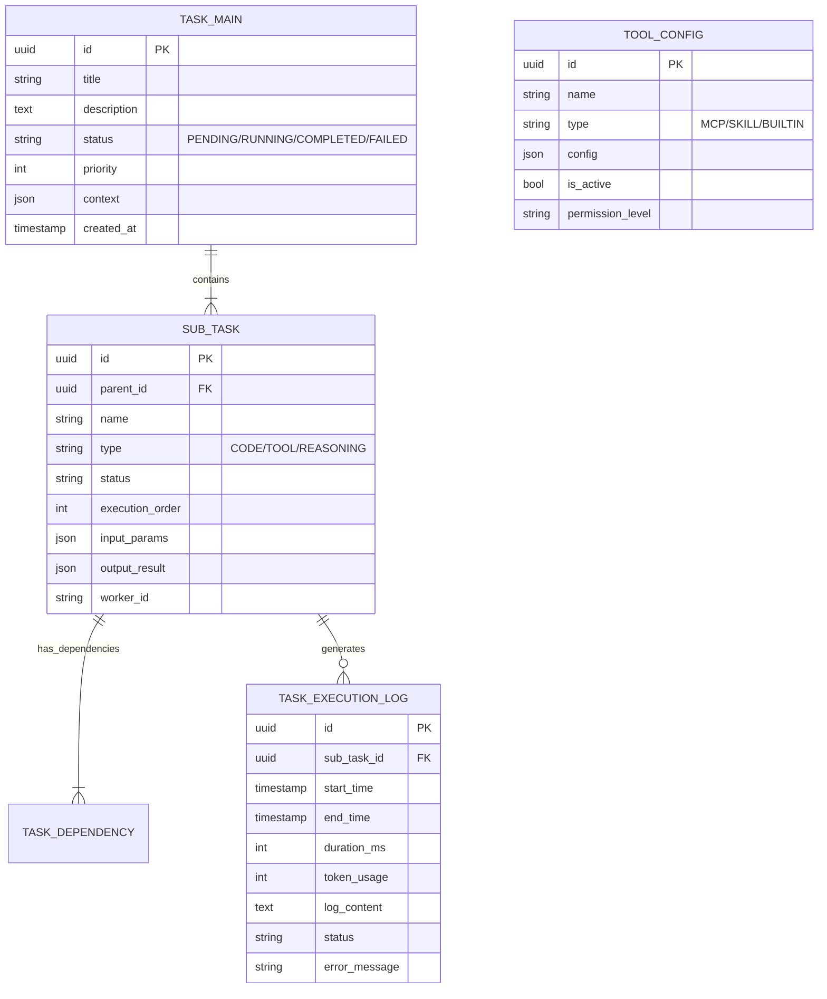
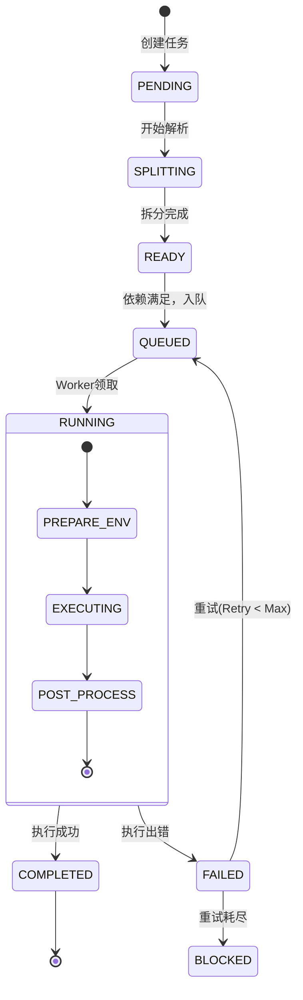

# 系统架构改造方案 (System Architecture Transformation Plan)

## 1. 系统总体架构

本方案旨在构建一个高可用、可扩展的智能体任务执行系统。系统采用微服务架构思想，将核心功能解耦为独立的服务模块，通过消息队列进行异步通信，支持水平扩展。

### 1.1 架构概览图 (Mermaid)

```mermaid
graph TB
    subgraph Client Layer
        Web[Web Frontend]
        Mobile[Mobile App]
        API_Client[3rd Party API]
    end

    subgraph API Gateway
        Gateway[API Gateway / Load Balancer]
    end

    subgraph Core Services
        TaskAPI[Task Management Service]
        Parser[Task Parser Engine]
        Splitter[Smart Task Splitter]
    end

    subgraph Execution Layer
        Scheduler[Execution Scheduler]
        WorkerPool[Worker Pool]
        Sandbox[Sandbox Environment (E2B/Docker)]
    end

    subgraph Resource Layer
        ToolRegistry[Tool Registry (MCP/Skills)]
        TokenController[Token Controller]
    end

    subgraph Data & Message Layer
        DB[(Primary Database - PostgreSQL)]
        Redis[(Redis Cache & Queue)]
        LogStore[(Log Store - ELK/Loki)]
    end

    Client Layer --> Gateway
    Gateway --> TaskAPI
    TaskAPI --> Parser
    Parser --> Splitter
    Splitter --> TaskAPI
    TaskAPI -- Push Task --> Redis
    Redis -- Pop Task --> Scheduler
    Scheduler --> WorkerPool
    WorkerPool --> Sandbox
    WorkerPool --> ToolRegistry
    WorkerPool --> TokenController
    WorkerPool -- Update Status --> TaskAPI
    WorkerPool -- Save Log --> LogStore
    TaskAPI --> DB
```

### 1.2 模块交互流程

1.  **任务提交**: 用户通过API提交复杂任务请求。
2.  **解析与拆分**:
    *   `Task Management Service` 接收请求，调用 `Task Parser Engine` 解析意图。
    *   `Smart Task Splitter` 将复杂任务拆解为原子子任务（Sub-tasks），并构建依赖图（DAG）。
    *   任务及子任务信息持久化至 `Primary Database`，初始状态为 `PENDING`。
3.  **任务调度**:
    *   根任务或无依赖的子任务被推送到 `Redis` 任务队列。
    *   `Execution Scheduler` 监听队列，根据优先级和资源空闲情况拉取任务。
4.  **任务执行**:
    *   `Worker` 获取任务上下文。
    *   `Token Controller` 检查配额。
    *   `Tool Registry` 加载所需工具（MCP/Skills）。
    *   在 `Sandbox Environment` 中安全执行代码或调用工具。
5.  **结果处理**:
    *   执行结果存入数据库和日志系统。
    *   更新当前任务状态。
    *   触发后续依赖任务的调度。

## 2. 数据库设计

采用关系型数据库（推荐 PostgreSQL）存储结构化数据，Redis 用于缓存和队列。

### 2.1 ER图 (Mermaid)



### 2.2 表结构设计

#### 1. `tasks` (主任务表)
| 字段名 | 类型 | 描述 |
| :--- | :--- | :--- |
| id | UUID | 主键 |
| user_id | UUID | 所属用户 |
| original_prompt | TEXT | 原始提示词 |
| status | VARCHAR | 状态 (PENDING, PROCESSING, COMPLETED, FAILED) |
| priority | INT | 优先级 (1-10) |
| created_at | TIMESTAMP | 创建时间 |

#### 2. `sub_tasks` (子任务表)
| 字段名 | 类型 | 描述 |
| :--- | :--- | :--- |
| id | UUID | 主键 |
| parent_id | UUID | 关联主任务ID |
| task_type | VARCHAR | 任务类型 (CODE_GEN, DATA_RETRIEVAL, API_CALL) |
| status | VARCHAR | 状态 |
| dependencies | JSONB | 依赖的前序任务ID列表 |
| input_context | JSONB | 输入上下文 |
| output_result | JSONB | 执行结果 |
| retry_count | INT | 重试次数 |

#### 3. `execution_logs` (执行记录表)
| 字段名 | 类型 | 描述 |
| :--- | :--- | :--- |
| id | UUID | 主键 |
| sub_task_id | UUID | 关联子任务 |
| tokens_used | INT | 消耗Token数 |
| stdout | TEXT | 标准输出 |
| stderr | TEXT | 错误输出 |
| duration | INT | 耗时(ms) |

#### 4. `tools` (工具配置表)
| 字段名 | 类型 | 描述 |
| :--- | :--- | :--- |
| id | UUID | 主键 |
| name | VARCHAR | 工具名称 |
| schema | JSONB | 工具Schema定义 |
| endpoint | VARCHAR | MCP服务地址或本地路径 |
| type | VARCHAR | MCP / SKILL / NATIVE |

## 3. API 接口规范 (RESTful)

### 3.1 任务管理
*   `POST /api/v1/tasks`: 提交新任务
    *   Request: `{ "prompt": "...", "priority": 1 }`
    *   Response: `{ "task_id": "..." }`
*   `GET /api/v1/tasks/{task_id}`: 获取任务详情及进度
*   `POST /api/v1/tasks/{task_id}/cancel`: 取消任务

### 3.2 调试与日志
*   `GET /api/v1/tasks/{task_id}/logs`: 获取全链路日志
*   `GET /api/v1/tasks/{task_id}/trace`: 获取任务执行轨迹

### 3.3 工具管理
*   `GET /api/v1/tools`: 列出可用工具
*   `POST /api/v1/tools/register`: 注册新工具 (MCP/Skill)

## 4. 任务状态机



## 5. 错误处理与重试机制

1.  **指数退避重试 (Exponential Backoff)**:
    *   对于临时性错误（如网络超时、API限流），采用 `InitialInterval * 2^n` 的策略进行重试。
    *   最大重试次数默认为 3 次。
2.  **死信队列 (Dead Letter Queue)**:
    *   超过重试次数的任务移入死信队列，防止阻塞正常任务。
    *   提供后台管理界面手动处理死信任务。
3.  **熔断机制**:
    *   当某个 Tool 或 MCP 连续失败率超过阈值（如 50%），暂时熔断该工具的调用，直接返回错误或切换备用方案。

## 6. 性能优化方案

1.  **缓存策略**:
    *   **Result Cache**: 对确定性任务（如数据查询）的结果进行 Redis 缓存（TTL 1小时）。
    *   **Context Cache**: 任务执行上下文较大时，存储在 Redis 或 S3，Worker 仅传递引用。
2.  **数据库优化**:
    *   **索引**: 对 `status`, `created_at`, `parent_id` 建立联合索引，加速任务查询。
    *   **读写分离**: 主库负责写入状态，从库负责查询日志和报表。
3.  **连接池**:
    *   使用 SQLAlchemy `AsyncEngine` 连接池，配置 `pool_size=20`, `max_overflow=10`。
    *   Redis 使用连接池管理连接。
