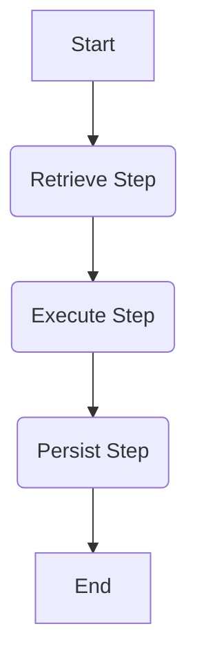
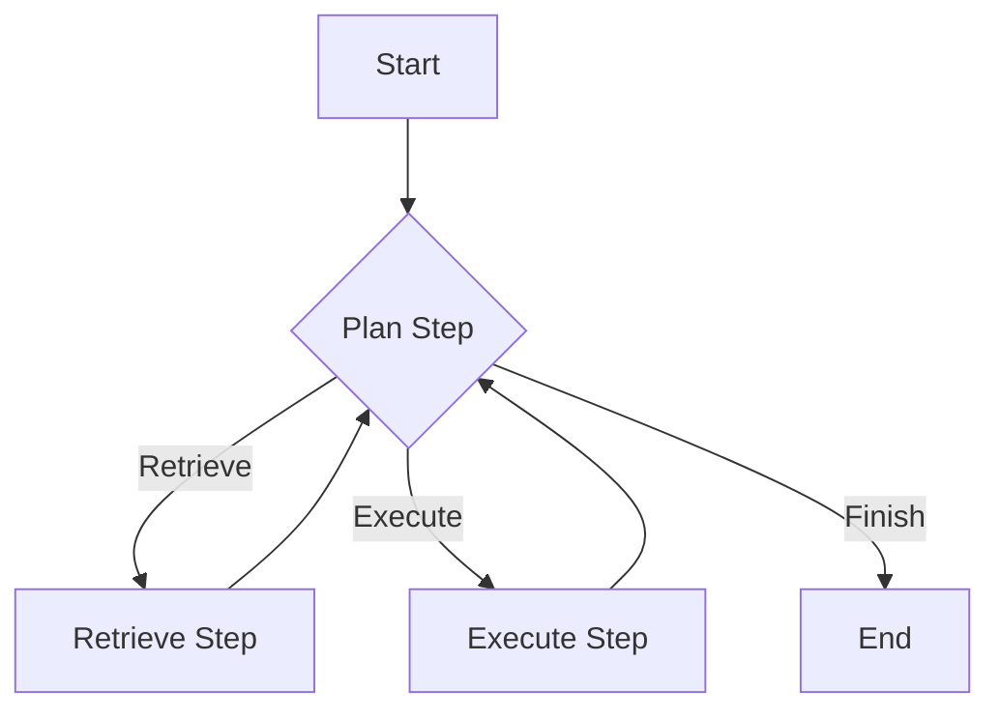

# Agno Workflow 架构文档

> **版本**: 1.0.0
> **最后更新**: 2026-02-24
> **状态**: 已发布

## 1. 简介 (Introduction)
本文档描述了 Agent 系统基于工作流（Workflow）的新架构。该架构利用 `agno.Workflow` 来编排 Agent 的执行流程，将复杂的业务逻辑拆解为原子化的步骤（Steps），支持静态 DAG 和动态规划两种模式。

## 2. 核心概念 (Core Concepts)

*   **Workflow**: 工作流容器，负责管理状态和执行步骤。
*   **Step**: 原子化的执行单元，如检索、执行、持久化。
*   **Static Mode**: 静态模式，按照预定义的 DAG 顺序执行。
*   **Dynamic Mode**: 动态模式，由 Planner Agent 决定下一步执行什么。

## 3. 详细说明 (Detailed Description)

### 3.1 核心步骤 (Steps)

| 步骤名称 | 功能描述 |
| :--- | :--- |
| `rag_retrieve_step` | 从知识库检索相关文档。 |
| `agent_execute_step` | 执行 Agent 核心逻辑（LLM 生成、工具调用），支持流式输出。 |
| `persist_step` | 将助手的回复和元数据保存到数据库。 |
| `plan_step` | (仅动态模式) 根据上下文规划下一步行动。 |

### 3.2 流程图 (Flowchart)

#### 静态模式 (Static Mode)

#### 动态模式 (Dynamic Mode)

## 4. 配置说明 (Configuration)

通过环境变量控制工作流模式：

| 配置项 | 可选值 | 默认值 | 说明 |
| :--- | :--- | :--- | :--- |
| `WORKFLOW_MODE` | `static`, `dynamic` | `static` | 设置工作流的运行模式 |

## 5. 代码参考 (Code Reference)

*   Workflow 定义: `backend/app/workflow/app_workflow.py`
*   Steps 定义: `backend/app/workflow/steps/`

## 6. 变更日志 (Changelog)

| 日期 | 版本 | 变更内容 | 作者 |
| :--- | :--- | :--- | :--- |
| 2026-02-24 | 1.0.0 | 初始文档归档 | Tiga |
