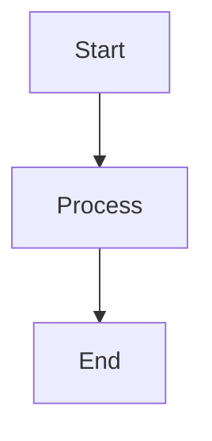

# [模块名称] - [文档类型/功能名称]

> **版本**: 1.0.0
> **作者**: Tiga Team
> **最后更新**: 2026-02-24
> **状态**: [草稿/进行中/已完成/已废弃]

## 1. 简介 (Introduction)

简要说明本文档的目的、适用范围以及该模块的核心功能。

## 2. 核心概念 (Core Concepts)

解释该模块涉及的关键术语和概念。

*   **Term 1**: Description...
*   **Term 2**: Description...

## 3. 详细说明 (Detailed Description)

### 3.1 功能描述
详细描述功能逻辑。

### 3.2 流程图 (Flowchart)
使用 Mermaid 绘制流程图。



## 4. API 参考 (API Reference)

### 4.1 [接口名称]

*   **URL**: `/api/v1/resource`
*   **Method**: `POST`
*   **Summary**: 简要描述接口功能。

#### 请求参数 (Request Parameters)

| 参数名 | 类型 | 必选 | 说明 |
| :--- | :--- | :--- | :--- |
| `id` | string | 是 | 资源 ID |

#### 请求示例 (Request Example)

```json
{
  "key": "value"
}
```

#### 响应参数 (Response Parameters)

| 参数名 | 类型 | 说明 |
| :--- | :--- | :--- |
| `status` | string | 状态 |

#### 响应示例 (Response Example)

```json
{
  "status": "success",
  "data": {}
}
```

#### 错误码 (Error Codes)

| 代码 | 说明 |
| :--- | :--- |
| `400` | Bad Request |

## 5. 配置说明 (Configuration)

列出相关的配置项及其说明。

| 配置项 | 默认值 | 说明 |
| :--- | :--- | :--- |
| `ENABLE_FEATURE` | `false` | 是否开启该功能 |

## 6. 注意事项 (Notes)

*   Point 1
*   Point 2

## 7. 变更日志 (Changelog)

| 日期 | 版本 | 变更内容 | 作者 |
| :--- | :--- | :--- | :--- |
| 2026-02-24 | 1.0.0 | 初始创建 | Tiga |
