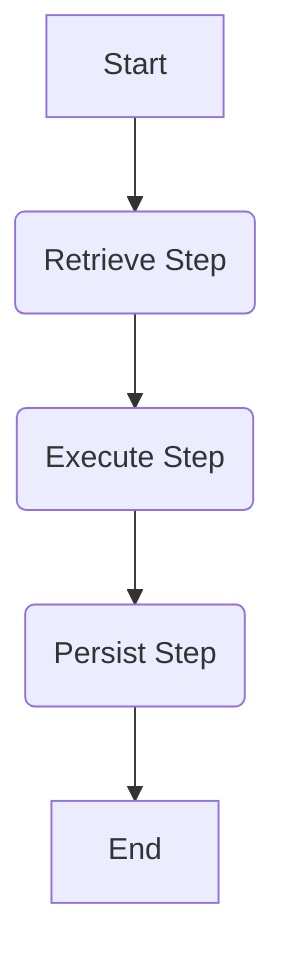

# Agno Workflow Architecture

This document describes the new Workflow-based architecture for the Agent System.

## Overview

The system uses `agno.Workflow` to orchestrate agent execution.
All logic is split into atomic `Steps`.

## Steps

- **rag_retrieve_step**: Retrieves documents from the Knowledge Base.
- **agent_execute_step**: Executes the Agent logic (LLM generation, Tool calls). Supports streaming.
- **persist_step**: Saves the assistant's response and metadata to the database.
- **plan_step**: (Dynamic Mode only) Decides the next step based on context.

## Workflow Modes

### Static Mode (Default)
A fixed DAG:
`Start -> Retrieve -> Execute -> Persist -> End`

### Dynamic Mode
Driven by `WorkflowAgent` (Planner):
`Start -> Plan -> [Step] -> Plan -> ... -> Finish`

## DAG Diagram (Static)

## Configuration

Set `WORKFLOW_MODE=dynamic` in environment variables to enable dynamic planning.
