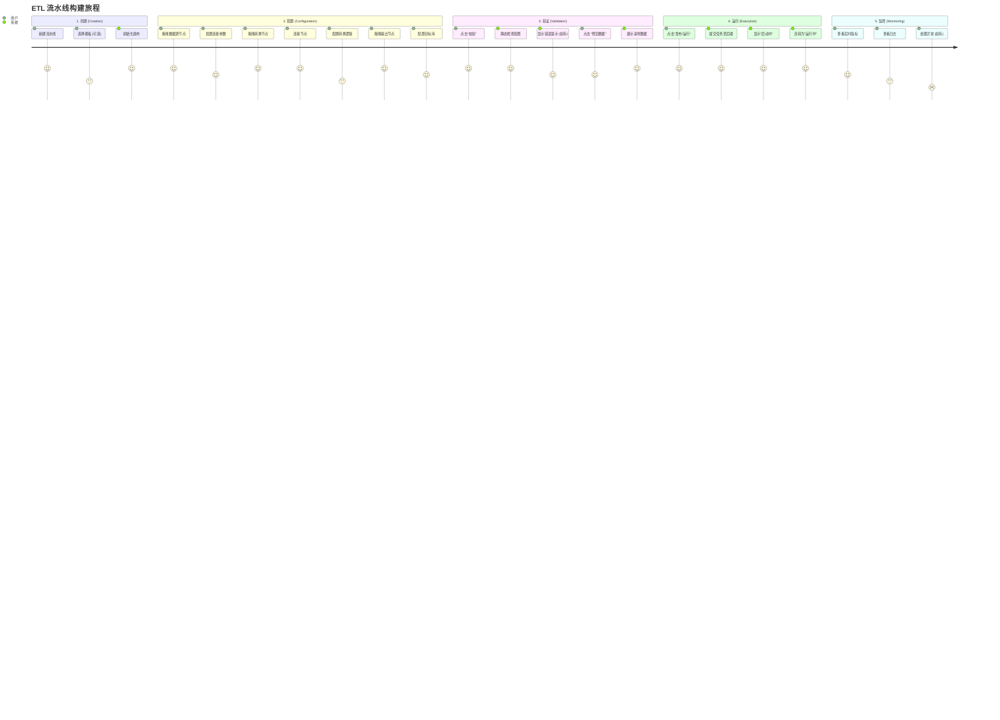
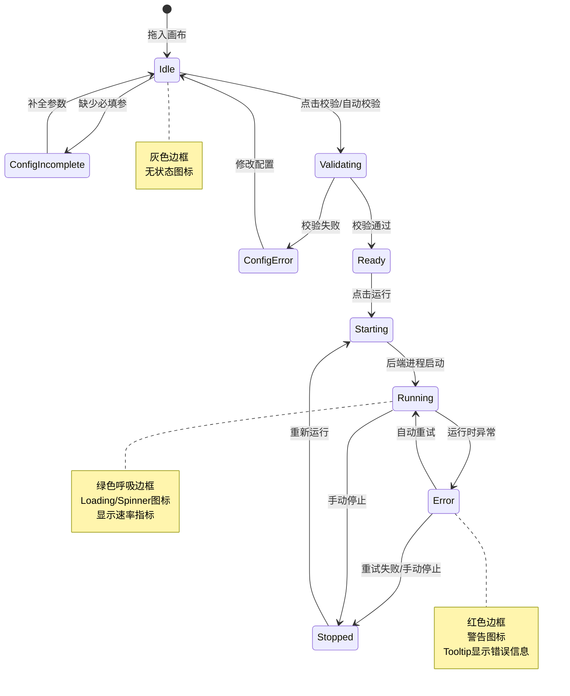

# 交互设计 (Interaction Design)

## 1. 用户旅程图 (User Journey Map)

## 2. 节点状态机 (Node State Machine)

## 3. 交互细节说明

### 画布操作
- **拖拽 (Drag & Drop)**: 左侧组件库 -> 画布。
- **连接 (Connect)**: 节点右侧锚点 -> 目标节点左侧锚点。
- **框选 (Selection)**: 按住鼠标左键拖动框选多个节点。
- **快捷键**:
    - `Ctrl + S`: 保存
    - `Ctrl + Z`: 撤销
    - `Delete / Backspace`: 删除选中节点/连线
    - `Space + Drag`: 拖动画布

### 节点反馈
- **Hover**: 显示简要信息（类型、名称）。
- **Selected**: 蓝色高亮边框，右侧展开属性面板。
- **Running**: 节点右上角显示绿色状态点，连接线上显示流动动画。
- **Error**: 节点变红，点击显示错误详情 Modal。

### 属性面板 (右侧)
- **动态表单**: 根据节点类型渲染不同配置项。
- **即时校验**: 输入框失去焦点时进行格式校验。
- **代码编辑**: 对于 UDF 节点，提供嵌入式 Monaco Editor。
