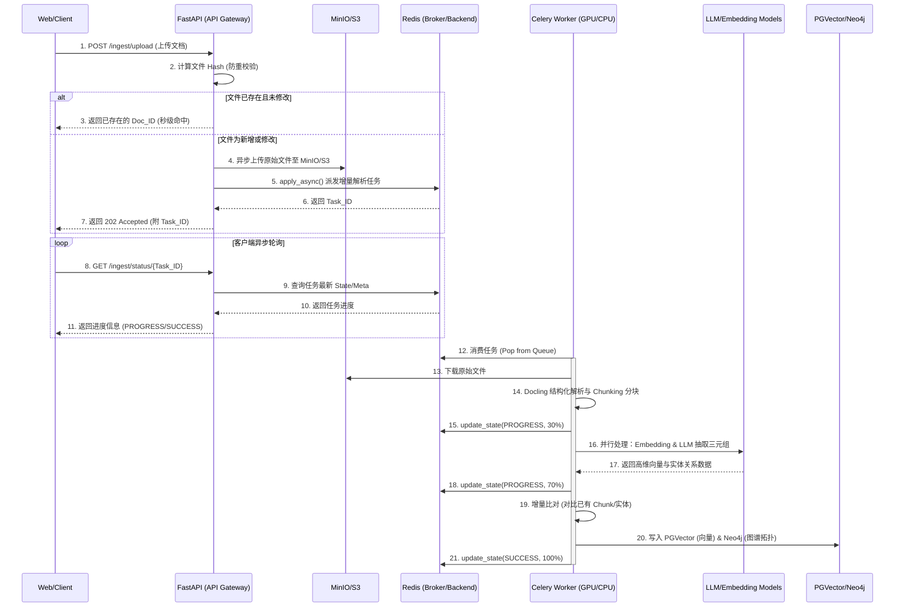
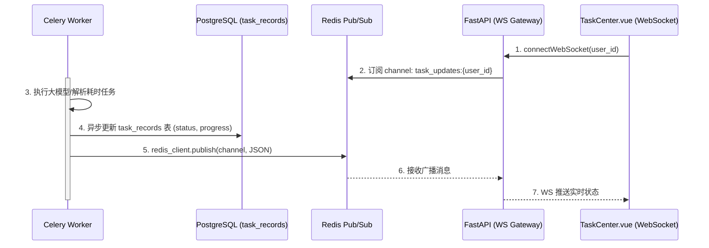

# 分布式异步计算架构设计方案 (Celery + Redis)

> 说明：本文件偏向“异步任务/分布式计算”的设计思路与选型记录。当前仓库中任务体系包含运行任务（TaskRun/AsyncTask）、执行编排（ExecutionTask）、任务模板（TaskMode）与流水线作业（PathwayJob）等多套实现。
>  
> 平台级统一方案与迁移路线详见：[任务平台统一方案.md](file:///Users/xucao/Documents/Python项目/Tiga/docs/task/任务平台统一方案.md)。

## 1. 架构哲学与第一性原理 (Architecture Philosophy & Trade-offs)

**设计目标**：剥离高耗时、计算密集型任务（如大模型推理、大规模 PDF 解析、GraphRAG 索引构建），保障主干 API 链路的极致响应与高可用。

**Trade-offs (背后的权衡)**：

- **为什么选 Redis 而非 RabbitMQ？**
  - 本系统中任务大多具备强状态依赖（需要频繁 `update_state` 供前端轮询进度），Redis 的 KV 内存模型在处理状态回写时比 RabbitMQ 更具优势，且运维成本更低。我们在此牺牲了部分极端情况下的消息持久化可靠性，换取了极致的吞吐和极低的状态更新延迟。
- **序列化方案选型**：
  - 弃用默认的 `json`，改用 `msgpack`。在传输大块文本或高维向量元数据时，`msgpack` 的二进制特性更贴近内存布局，反序列化性能提升显著，有效降低 CPU 缓存未命中率 (Cache Miss) 和内存逃逸风险。

## 2. 全局拓扑与时序链路 (Global Topology & Sequence)

**模块影响面分析 (Blast Radius)**：

- **API 层 (FastAPI)**：完全解耦，仅负责文件预处理（如哈希校验、S3上传）、任务派发与状态查询，绝不受 GPU/CPU 拥塞影响，时间复杂度必须保持在 O(1)。
- **计算层 (Celery Worker)**：直接与模型（LLM/Embedding）交互，执行解析、分块、三元组提取等长耗时操作。必须显式控制并发数，避免显存 (VRAM) 溢出。
- **存储层 (Redis/Neo4j/PGVector/MinIO)**：Redis 承担消息总线与状态库；MinIO/S3 存储原始文件；PGVector/Neo4j 存储增量更新的向量与图谱数据。需严格防御其内存与存储水位。

### 核心处理时序图



## 3. 极致性能与架构确定性配置 (Performance & Determinism)

### 3.1 目录范式

采用高度解耦的领域驱动设计（DDD）目录结构：

```text
├── core/
│   ├── celery_app.py      # 核心队列实例与架构配置
│   ├── redis_pool.py      # Redis 连接池与零拷贝优化
│   └── tasks/             # 任务路由分组
│       ├── io_tasks.py    # IO 密集型 (如爬虫、API请求)
│       └── gpu_tasks.py   # GPU/CPU 密集型 (如 Embedding, OCR)
```

### 3.2 核心配置 (`core/celery_app.py`)

> **为什么这么设计？(Why)**
>
> 1. `worker_max_tasks_per_child`：深度学习模型在 Python 中极易引发内存泄露。通过限制 Worker 生命周期，从物理层面阻断 OOM。
> 2. `task_serializer="msgpack"`：降低序列化开销，减少 CPU 耗损。
> 3. `task_routes`：物理隔离 CPU 与 IO 任务，避免低优先级长耗时任务阻塞高优快速任务。

```python
from celery import Celery

celery_app = Celery(
    "tiga_worker",
    broker="redis://localhost:6379/0",
    backend="redis://localhost:6379/1"
)

celery_app.conf.update(
    # 【性能极致】采用 msgpack 替代 json，提升序列化性能与内存密度
    task_serializer="msgpack",
    result_serializer="msgpack",
    accept_content=["msgpack", "json"],
    
    timezone="Asia/Shanghai",
    enable_utc=True,
    
    # 【架构确定性】防止 AI 模型推理引发的显存/内存泄露 (Memory Leak)
    # 每个 Worker 进程执行完 50 个任务后自动销毁重建，释放底层 C/C++ 句柄
    worker_max_tasks_per_child=50,
    
    # 【资源隔离】限制并发数，防止 GPU OOM。根据实际显存调整
    worker_concurrency=4,
    
    # 【预取机制】对于高耗时任务，禁用预取或设为 1，防止任务在个别 Worker 内存中堆积饿死
    worker_prefetch_multiplier=1,
    
    # 【全局感知】路由隔离：按任务特性分发到不同队列
    task_routes={
        'tasks.gpu.*': {'queue': 'gpu_heavy'},
        'tasks.io.*': {'queue': 'io_light'},
    }
)
```

### 3.3 具备重试与防抖的任务定义 (`tasks/gpu_tasks.py`)

> **为什么这么设计？(Why)**
> 在分布式系统中，失败是常态。必须引入 `autoretry_for` 和指数退避 (Exponential Backoff)，以应对 LLM API 限流或网络抖动。代码设计必须保证幂等性 (Idempotency)。

```python
import time
from core.celery_app import celery_app

# 指数退避重试，最大重试 3 次，处理外部 API 抖动或网络瞬断
@celery_app.task(
    bind=True, 
    name="tasks.gpu.process_document",
    autoretry_for=(Exception,), 
    retry_kwargs={'max_retries': 3},
    retry_backoff=True,  # 启用指数退避
    retry_backoff_max=60 # 最大退避 60 秒
)
def process_document_task(self, file_path: str, doc_id: str, file_hash: str):
    """
    异步处理文档生命周期。
    设计原则：保证幂等性，即使重试也不应产生脏数据或引发主键冲突。
    """
    try:
        self.update_state(state='PROGRESS', meta={'progress': 10, 'status': '下载原始文件与 Docling 结构化解析...'})
        # TODO: 从 S3 下载文件并调用 Docling 进行文档解析 (保留表格、图片、段落层级)
        time.sleep(1) 
        
        self.update_state(state='PROGRESS', meta={'progress': 30, 'status': '智能语义分块 (Chunking)...'})
        # TODO: 基于 Docling 结构进行段落/标题感知的智能分块
        time.sleep(1)
        
        self.update_state(state='PROGRESS', meta={'progress': 50, 'status': '并行计算: Embedding & 抽取知识图谱三元组...'})
        # TODO: 
        # 1. 调用 BGE/OpenAI 模型生成 Chunk 向量
        # 2. 调用 LLM 从 Chunk 中抽取 (实体-关系-实体) 三元组
        time.sleep(1)

        self.update_state(state='PROGRESS', meta={'progress': 80, 'status': '增量比对与去重入库...'})
        # TODO: 
        # 1. 增量更新逻辑：根据 file_hash 或 chunk_hash 判断是否已有相同内容，避免重复计算
        # 2. 向量写入 PGVector，实体与关系合并/更新至 Neo4j (执行 Upsert)
        time.sleep(1)

        # 最终状态回写
        return {
            "doc_id": doc_id, 
            "status": "COMPLETED", 
            "metrics": {"chunks": 120, "nodes_created": 150, "edges_created": 200}
        }
    
    except Exception as e:
        # 异常捕获与状态机转移
        self.update_state(state='FAILURE', meta={'error': str(e)})
        raise e # 触发 celery 的 autoretry
```

## 4. 前后端通信范式与接口契约 (Frontend-Backend Contract)

> **为什么这么设计？(Why)**
> 纯后端的 Celery + Redis 架构只解决了“算力卸载”问题，但无法直接满足前端 `TaskCenter.vue` 对于“实时高频状态更新”、“按用户维度的历史任务聚合”以及“软删除”的需求。如果仅仅提供轮询 (Polling) 接口，会引发严重的网络 I/O 拥塞和 Redis 连接数耗尽。
>
> **P10 级架构重构方案**：引入 `持久化层 (PostgreSQL)` 替代 Redis Backend 作为列表查询源，并使用 `WebSocket + Redis Pub/Sub` 实现 O(1) 复杂度的事件驱动推送，彻底抛弃前端轮询。

### 4.1 任务持久化层 (Task Record)

必须在数据库中建立 `task_records` 表，作为全生命周期的 Single Source of Truth。

```sql
CREATE TABLE task_records (
    task_id VARCHAR(64) PRIMARY KEY, -- 对应 Celery UUID
    user_id VARCHAR(64) NOT NULL,    -- 租户隔离，支撑前端 fetchTasks(userId)
    task_name VARCHAR(255) NOT NULL, -- 任务展示名称
    status VARCHAR(20) NOT NULL,     -- 映射后的标准化状态: pending, processing, success, error
    progress INT DEFAULT 0,          -- 0-100 进度
    msg TEXT,                        -- 节点详情
    is_deleted BOOLEAN DEFAULT FALSE,-- 软删除标识 (支撑前端 removeTask 和 clearCompletedTasks)
    created_at TIMESTAMP DEFAULT CURRENT_TIMESTAMP,
    updated_at TIMESTAMP DEFAULT CURRENT_TIMESTAMP
);
CREATE INDEX idx_user_task ON task_records(user_id, is_deleted, created_at DESC);
```

### 4.2 WebSocket 全链路推送拓扑



### 4.3 FastAPI 防腐层与 RESTful 契约 (`fastapi_app.py`)

API 层必须提供以下接口来完全闭环 `TaskCenter.vue` 的状态管理需求，并在内部做状态机映射 (Celery State -> Frontend State)。

```python
from fastapi import FastAPI, WebSocket, Depends
import json

# ==========================================
# 1. 状态机防腐层 (Anti-Corruption Layer)
# ==========================================
def map_celery_to_frontend(celery_state: str) -> str:
    """将 Celery 的底层状态映射为前端 TaskCenter 期望的 4 种枚举"""
    mapping = {
        "PENDING": "pending",
        "PROGRESS": "processing",
        "STARTED": "processing",
        "RETRY": "processing",
        "SUCCESS": "success",
        "FAILURE": "error"
    }
    return mapping.get(celery_state, "pending")

# ==========================================
# 2. RESTful 历史与管理接口
# ==========================================
@app.get("/tasks")
async def get_user_tasks(user_id: str):
    """
    对应前端 `taskStore.fetchTasks(userId)`
    从 PostgreSQL 查询未被软删除的历史任务列表
    """
    # TODO: SELECT * FROM task_records WHERE user_id=? AND is_deleted=FALSE ORDER BY created_at DESC
    pass

@app.delete("/tasks/{task_id}")
async def remove_task(task_id: str):
    """
    对应前端 `taskStore.removeTask(id)`
    注意：这里仅做前端隐藏（软删除 UPDATE is_deleted=True），绝不能终止后台 Celery 进程，做到彻底解耦。
    """
    pass

@app.delete("/tasks/completed")
async def clear_completed_tasks(user_id: str):
    """
    对应前端 `taskStore.clearCompletedTasks()`
    批量软删除状态为 'success' 或 'error' 的记录
    """
    pass

# ==========================================
# 3. WebSocket 实时推送层
# ==========================================
@app.websocket("/ws/tasks/{user_id}")
async def websocket_task_endpoint(websocket: WebSocket, user_id: str):
    """
    对应前端 `taskStore.connectWebSocket(userId)`
    """
    await websocket.accept()
    pubsub = redis_client.pubsub()
    # 订阅该用户专属的更新频道
    await pubsub.subscribe(f"task_updates:{user_id}")
    
    try:
        async for message in pubsub.listen():
            if message['type'] == 'message':
                data = json.loads(message['data'])
                # 发送给 TaskCenter.vue 触发响应式更新
                await websocket.send_json(data)
    except Exception as e:
        pass
    finally:
        await pubsub.unsubscribe()
        await websocket.close()
```

## 5. 部署与技术护城河 (Deployment & Moat Building)

为了确保高并发下的系统存活率与架构确定性，环境部署必须遵循以下强制规范：

**1. 启动队列 (按职责进行物理隔离)**

```bash
# 启动 GPU 密集型消费者 (严格限制并发，保护 VRAM 不发生 OOM)
celery -A core.celery_app worker -Q gpu_heavy --concurrency=2 --loglevel=info -n gpu_worker@%h

# 启动 IO 密集型消费者 (可放开并发)
celery -A core.celery_app worker -Q io_light --concurrency=20 --loglevel=info -n io_worker@%h
```

**2. Redis 内存护城河**
因为 RAG 过程会产生海量中间元数据，且带有频次极高的 `update_state`，务必在 Redis 配置 (`redis.conf`) 中设置淘汰策略，否则一旦 Redis OOM，整个总线链路将彻底崩溃：

```text
# 限制最大内存上限 (根据服务器规格决定)
maxmemory 4gb
# 达到阈值后，淘汰最近最少使用的 Key，防撑爆
maxmemory-policy allkeys-lru
```

**3. 拓扑监控**

```bash
# 实时洞察队列堆积情况与 Worker 存活状态
pip install flower
celery -A core.celery_app flower --port=5555
```

## 6. 落地执行计划 (Execution Roadmap)

### 阶段一：基础设施与持久化层重构 (1天)
1. **DB 演进**：执行 `task_records` 表 DDL，建立复合索引。
2. **ORM 映射**：在 `models` 目录下创建 `TaskRecord` 实体类。
3. **Task 拦截器**：重写 Celery `Task` 基类，在 `apply_async` 和 `on_success/failure` 时自动同步 DB 状态。

**实施代码示例 (SQLAlchemy & Celery Base Task):**

```python
# models/task_record.py
from sqlalchemy import Column, String, Integer, Boolean, DateTime, Text, Index
from sqlalchemy.sql import func
from core.database import Base

class TaskRecord(Base):
    __tablename__ = "task_records"
    
    task_id = Column(String(64), primary_key=True, index=True)
    user_id = Column(String(64), nullable=False, index=True)
    task_name = Column(String(255), nullable=False)
    status = Column(String(20), nullable=False, default="pending")
    progress = Column(Integer, default=0)
    msg = Column(Text, nullable=True)
    is_deleted = Column(Boolean, default=False)
    created_at = Column(DateTime(timezone=True), server_default=func.now())
    updated_at = Column(DateTime(timezone=True), server_default=func.now(), onupdate=func.now())

# 复合索引，用于快速获取用户的有效任务列表
Index('idx_user_task', TaskRecord.user_id, TaskRecord.is_deleted, TaskRecord.created_at.desc())
```

```python
# core/celery_base.py
from celery import Task
from core.database import SessionLocal
from models.task_record import TaskRecord
import redis
import json

redis_client = redis.Redis(host='localhost', port=6379, db=0)

class DBSyncTask(Task):
    """
    P10 级架构：Celery 任务基类拦截器
    自动处理数据库持久化和 Redis 广播，业务代码零侵入
    """
    abstract = True

    def broadcast_update(self, user_id: str, task_id: str, status: str, progress: int, msg: str):
        # 1. 持久化到 DB
        with SessionLocal() as db:
            task = db.query(TaskRecord).filter(TaskRecord.task_id == task_id).first()
            if task:
                task.status = status
                task.progress = progress
                task.msg = msg
                db.commit()
        
        # 2. 广播到 Redis Pub/Sub，供 FastAPI 推送给前端 WebSocket
        channel = f"task_updates:{user_id}"
        payload = {
            "id": task_id,
            "status": status,
            "progress": progress,
            "msg": msg
        }
        redis_client.publish(channel, json.dumps(payload))

    def on_success(self, retval, task_id, args, kwargs):
        # 约定：异步任务必须传入 user_id 以便追踪
        user_id = kwargs.get('user_id', 'anonymous')
        self.broadcast_update(user_id, task_id, "success", 100, "任务执行完成")
        super().on_success(retval, task_id, args, kwargs)

    def on_failure(self, exc, task_id, args, kwargs, einfo):
        user_id = kwargs.get('user_id', 'anonymous')
        self.broadcast_update(user_id, task_id, "error", self.request.kwargs.get('progress', 0), str(exc))
        super().on_failure(exc, task_id, args, kwargs, einfo)

    def update_state(self, task_id=None, state=None, meta=None):
        """重写 update_state，拦截中间状态并落库+广播"""
        super().update_state(task_id=task_id, state=state, meta=meta)
        if meta and isinstance(meta, dict):
            user_id = self.request.kwargs.get('user_id', 'anonymous')
            current_id = task_id or self.request.id
            progress = meta.get('progress', 0)
            msg = meta.get('status', '')
            
            # 状态映射: Celery(PROGRESS) -> Frontend(processing)
            mapped_status = "processing" if state in ["PROGRESS", "STARTED", "RETRY"] else "pending"
            
            self.broadcast_update(user_id, current_id, mapped_status, progress, msg)
```

### 阶段二：WebSocket 与事件总线打通 (1天)
1. **Redis 广播**：Worker 节点封装 `broadcast_task_update` 方法，底层通过 `redis.publish` 发送状态。
2. **WS 路由**：实现 FastAPI WebSocket 路由，订阅 Redis Channel 并实时推送到前端。
3. **保活机制**：处理 WS 心跳与异常断开时的资源释放。

**实施代码示例 (FastAPI WebSocket & Connection Manager):**

```python
# core/websocket_manager.py
from fastapi import WebSocket
from typing import Dict, List
import asyncio
import json

class ConnectionManager:
    def __init__(self):
        # 记录用户与 WebSocket 的映射关系，支持多端登录
        self.active_connections: Dict[str, List[WebSocket]] = {}

    async def connect(self, websocket: WebSocket, user_id: str):
        await websocket.accept()
        if user_id not in self.active_connections:
            self.active_connections[user_id] = []
        self.active_connections[user_id].append(websocket)

    def disconnect(self, websocket: WebSocket, user_id: str):
        if user_id in self.active_connections:
            self.active_connections[user_id].remove(websocket)
            if not self.active_connections[user_id]:
                del self.active_connections[user_id]

    async def send_personal_message(self, message: dict, user_id: str):
        if user_id in self.active_connections:
            for connection in self.active_connections[user_id]:
                try:
                    await connection.send_json(message)
                except Exception:
                    # 处理死连接
                    self.disconnect(connection, user_id)

manager = ConnectionManager()
```

```python
# routers/websocket.py
from fastapi import APIRouter, WebSocket, WebSocketDisconnect
from core.websocket_manager import manager
import asyncio
import json

router = APIRouter()

async def redis_listener(user_id: str):
    """后台任务：监听特定用户的 Redis 频道并推送至 WebSocket"""
    pubsub = redis_client.pubsub()
    await pubsub.subscribe(f"task_updates:{user_id}")
    
    try:
        async for message in pubsub.listen():
            if message['type'] == 'message':
                data = json.loads(message['data'])
                await manager.send_personal_message(data, user_id)
    finally:
        await pubsub.unsubscribe()

@router.websocket("/ws/tasks/{user_id}")
async def websocket_endpoint(websocket: WebSocket, user_id: str):
    await manager.connect(websocket, user_id)
    
    # 启动 Redis 监听协程
    listener_task = asyncio.create_task(redis_listener(user_id))
    
    try:
        while True:
            # 保持连接，处理心跳 (Ping/Pong)
            data = await websocket.receive_text()
            if data == "ping":
                await websocket.send_text("pong")
    except WebSocketDisconnect:
        manager.disconnect(websocket, user_id)
    finally:
        listener_task.cancel()
```

### 阶段三：RESTful 契约接口开发 (0.5天)

1. **状态映射器**：实现 `map_celery_to_frontend` 逻辑。
2. **管理接口**：实现 `GET /tasks`, `DELETE /tasks/{id}`, `DELETE /tasks/completed` 逻辑。

### 阶段四：联调与边界压力测试 (0.5天)

1. **异常模拟**：模拟断网、Worker 宕机、模型超时等场景下的前端状态回退与自动恢复。
2. **并发验证**：验证 100+ 并发任务下的 WS 推送延迟与 Redis 负载。
